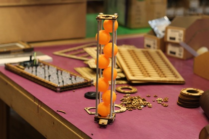

# OOML - Oomlout's Entry

## Files

* OOML-working.cdr	--Base file for working things out (source)
* OOML-working.pdf	--GENERATED pdf version of OOML-working.cdr
* OOML-working.dxf	--GENERATED dxf version of OOML-working.cdr
* OOML-working.svg	--GENERATED svg version of OOML-working.cdr

## Progress

2015-01-27 Starting Design, initial upload. Worked on ball shooter.
2015-01-28 Initial design worked on (Prototype One)
2015-02-03 Redesigned for new track style did (Prototype 2)
2015-02-05 Motor mounts ready to work on (Prototype 3)

## Process

### Shooter  

#### Prototype One
  
##### Summary
Using a single large drive wheel driven by drill. Pressure applied by setting gap with bolts. 
File: OLD01-OOML-working.cdr (all other formats generated)
##### Notes
* Large Wheel too big to spin too quickly
* Layered construction method can be simlified
* Circular magazine seems to work well (needs to be more firmly attached)
* Attaching to the drive shaft will be tricky.   
!

#### Prototype Two
  
##### Summary
Using a single drive wheel plans to drive with RC motor but gave up before making adapter. Tried gravity hold down for top wheel.
File: OLD02-OOML-working.cdr (all other formats generated)
##### Notes
* Single wheel drive doesn't seem to be sufficient
* Sandwich style ball run works well, leaves room to mount wheels around,
* Thinking mounting the drive wheel direct to motor is a good idea. (works with larger 'outrunner' style motors that have screw mounting points.     
!

#### Prototype Three
   
   
Moved to two drive motors. This is a good idea, also added rubber grip wheels which improved performance greatly.  
Firing test video. ( https://www.youtube.com/watch?v=qwCffyODwjQ )  

##### Problems
* A lot of issues with clearnces (motors rubbing)
* A lot of nasty layering encountered when assembling.
* Wheels aren't balanced.

### Ammunition Loading
How to deliver as much ammunition as possible to the shooter. Current thinking is a magazine based system with balls pre-loaded and fed by gravity. Perhaps adding a circular mechanism to deliver magazines.
	
#### Prototype One

Made with threaded rod and laser cut quarter circles. Holds balls well, is a lot of laser cutting (Capacity 7 per 30 cm)

#### Prototype Two

Only requires much less laser cutting, extending only requires lengthening threaded rod. (Feels a bit like cheating). (Capacity 8 per 30 cm)

### Turret
Portion for aiming the shooter.
#### Prototype One

### Currently Used Parts

* Motors
  * Turnigy Aerodrive SK3 - 3530-1340kv Brushless Outrunner Motor (x2)  [29470](http://www.hobbyking.co.uk/hobbyking/store/__29470__Turnigy_Aerodrive_SK3_3530_1340kv_Brushless_Outrunner_Motor_UK_Warehouse_.html)   
    * Stator Mounting Holes: 4 around a 25 mm diamter circle (M3 machine screws)    
	* Shaft Mounting Holes: 3 around a 15 mm diameter circle (M2.5 machine screws)    
* Drivers    
  * Turnigy TrackStar 25A 1/18th Scale Brushless Car ESC (x2) [28715](http://www.hobbyking.co.uk/hobbyking/store/__28715__Turnigy_TrackStar_25A_1_18th_Scale_Brushless_Car_ESC_UK_Warehouse_.html)    
      * Startup procedure: Turn on full power (wait for beeps), Zero Power (wait for beeps), Middle Power (wait for beeps).     

	

## Inspiration

### Launching
Currently preffered method, motor spinning disc.	
* [Lego Launcher](https://www.youtube.com/watch?v=IRtr5g4ApiQ)
* [Launcher using bare DC motor](https://www.youtube.com/watch?v=oGAJfsf9DJo)
	
### Feeding Balls
Various ways to feed balls.
* [Homemade Ball Feeder With Launcher](https://www.youtube.com/watch?v=HIMtHxMLO58) 

### Super Sonic Launching
Launching a ping pong ball at dangerous speeds by using a vacuum.
* [Mythbusters Version](https://www.youtube.com/watch?v=87Cpe4bJn0U) 
* [Purdue University News Visit](https://www.youtube.com/watch?v=YYNCGZCul1Q)  - Physics explained.

### Balancing a motor
Finding it difficult to mount a wheel without vibration.
* https://www.youtube.com/watch?v=QnjflLDxQQU

## Prototyping Parts

### HobbyKing 

| Item			| Link			| Notes
|---------------|---------------|---------
| Brushless Motor Driver (45A)|[42193](http://www.hobbyking.co.uk/hobbyking/store/uh_viewItem.asp?idProduct=42193)| Heavy duty motor controller, seemed common and was in stock in UK warehouse
| Small Brushless Motor (2725)|[57231](http://www.hobbyking.co.uk/hobbyking/store/uh_viewItem.asp?idProduct=57231)| Small motor, purchased due to high speed (1600 RPM/v) and low cost
| Servo tester 				  |[31882](http://www.hobbyking.co.uk/hobbyking/store/uh_viewItem.asp?idProduct=31882)| To make testing easy
| Brushless Motor Controller (6A)|[29556](http://www.hobbyking.co.uk/hobbyking/store/uh_viewItem.asp?idProduct=29556)| Cheapest in stock controller in UK warehouse 
|---------------|---------------|---------
|TrackStar 1/18th Scale 12T Brushless power System (5050kv) ( UK Warehouse)|[43532](http://www.hobbyking.com/hobbyking/store/__43532__TrackStar_1_18th_Scale_12T_Brushless_power_System_5050kv_UK_Warehouse_.html)| Speed controller and motor package
|Durafly™ Micro Series - Replacement Propeller Adapter (UK Warehouse)|[35199](http://www.hobbyking.com/hobbyking/store/__35199__Durafly_8482_Micro_Series_Replacement_Propeller_Adapter_UK_Warehouse_.html)|Propellor to shaft adapter (clamp on shaft)
|NTM Prop Drive 28 Series Accessory Pack (UK Warehouse)|[28454](http://www.hobbyking.com/hobbyking/store/__28454__NTM_Prop_Drive_28_Series_Accessory_Pack_UK_Warehouse_.html)|Prop adapter bolt on to motor
|Hobbyking X-Car Brushless Power System 4000KV/60A (UK Warehouse)|[42175](http://www.hobbyking.com/hobbyking/store/__42175__Hobbyking_X_Car_Brushless_Power_System_4000KV_60A_UK_Warehouse_.html)|Motor and controller kit (programmer for first motor controller too)
|---------------|---------------|---------
|Turnigy Aerodrive SK3 - 3530-1340kv Brushless Outrunner Motor (UK Warehouse)|[29470](http://www.hobbyking.co.uk/hobbyking/store/__29470__Turnigy_Aerodrive_SK3_3530_1340kv_Brushless_Outrunner_Motor_UK_Warehouse_.html)| Flat motor with screw mounting for shaft.
!Turnigy TrackStar 25A 1/18th Scale Brushless Car ESC (UK Warehouse)|[28715](http://www.hobbyking.co.uk/hobbyking/store/__28715__Turnigy_TrackStar_25A_1_18th_Scale_Brushless_Car_ESC_UK_Warehouse_.html)|Small compact high'ish current motor driver
!Turnigy TrackStar ESC Programing Card (UK Warehouse)|[29659](http://www.hobbyking.co.uk/hobbyking/store/__29659__Turnigy_TrackStar_ESC_Programing_Card_UK_Warehouse_.html)|Programming Card for Turnigy controller

### Ebay
| Item			| Link			| Notes
|---------------|---------------|---------
|Three Phase Stepper Driver|[ebay](http://www.ebay.co.uk/itm/CNC-3-Phase-Stepper-Motor-Driver-8-3A-3M860-for-Router-Mill-Engraving/261032431786?_trksid=p2045573.c100033.m2042&_trkparms=aid%3D111001%26algo%3DREC.SEED%26ao%3D1%26asc%3D20131017132637%26meid%3D26e5114eb5e944539a95eb8d47a47bbd%26pid%3D100033%26rk%3D1%26rkt%3D4%26sd%3D261032431786)| Drriver for three phase stepper motors, should work with rc motors too.

