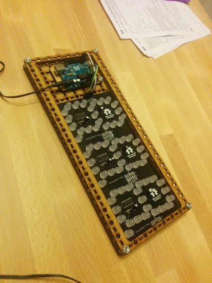

# Range

## Target

## Score Board  
   
The scoreboard is made using seven segment displays by [Matthew Venn](https://github.com/mattvenn/big-led-driver)

Files: MFUKLC-scoreboard-working.cdr (all other formats are generated (will switch to SVG once base design work done))

## Todo
* Sound -- Do we want a speaker or something more ecletic (fog horn)
* Target -- How many, what size/s how to house/hang

## Modules

### Control Module (CM)
The main control module.

#### Microcontroller Pins (Arduino Mega)
* DIGITAL 13 -- Start Button -- (pin 13 so can connect other pin to ground with standard 2 pin header)

#### Connectors
##### ARDUINO
* (U1) USB Type B -- For Arduino Connection
* (DC1) 2.1mm DC Jack -- For Power (12 v) 
* (BM) -- Button Module -- 2.1mm DC Jack -- N/O Switch
* (TM) -- Time Module -- 8 pin 2.54mm Dupont style connector 
* (SM) -- Score Module -- 8 pin 2.54mm Dupont style connector
* (RM) A-D -- Target modules -- To be determined.
### Parts
* BOLT-M6-X-12-01 (x32) -- M6 x 12 mm Bolt
* NUTT-M6-M-STAN-01 (x32) -- M6 Nut
* CM-01 (x1) -- Base Plate
* CM-02 (x2) -- Side Plate
* CM-02-C (x1) -- Side Plate (Connections) Score Board
* CM-02-B (x1) -- Side Plate (Connections) Arduino (NOT YET DESIGNED)
* CM-03 (x1) -- Top (to be cut from acrylic)
* OOBB-MP-BREB-05-03 (x2) -- Breadboard Mounting Plate (5x3)
* OOBB-MP-ARDM-07-03 (x1)Arduino Mega Mounting Plate (7x3)
* OOBB-MP-I01-08-03-02 (A-D) (x2) -- Mounting Plate 8 pin 2.54 mm Connector

### Time Module (TM)
A 3 digit display to show the 30 second countdown
#### Connectors
* Only one (OE,LE,CLK,SDI,12V,5V,gnd) (gnd black)
#### Parts
* BOLT-M6-X-12-01 (x20) -- M6 x 12 mm Bolt
* NUTT-M6-M-STAN-01 (x20) -- M6 Nut
* NHFF-M3-X-30-01 (x12) -- M3 x 30 mm Nylon Standoff (F-F)
* NSCR-M3-X-12-70 (x24) -- M3 x 12 mm Nylon Screw Cross Head
* Matrix Module (x3) -- [Matrix Module](https://github.com/mattvenn/big-led-driver) -- By Matt Venn
* TM-01 (x1) -- Back -- Back, holds the matrices, and connector block
* TM-02 (x2) -- Side (Long) -- Long side piece.
* TM-03 (x1) -- Side (Short) -- Short side.
* TM-03-C (x1) -- Side (Short, Connections) -- Short Side with connections.
* TM-05 (x1) -- Top -- Top (to be cut from smoked acrylic)
* OOBB-MP-I01-08-03-02 (A-D) (x1) -- Mounting Plate 8 pin 2.54 mm Connector

### Score Module (SM)
To be tackled once time module is stable (just a longer version)

### Target Module (RM) (x6) 
The targets
#### Connectors
* Only one 2.1mm barrel jack, center signal, outer gnd.
#### Parts
* BOLT-M6-X-12-01 (x8) -- M6 x 12 mm Bolt
* NUTT-M6-M-STAN-01 (x8) -- M6 Nut
* RM-01 (x1) -- Base -- The base that holds the PCB glued in place.
* RM-02 (x3) -- Side -- The side
* RM-02-C (x1) -- Side (Connections) -- The side with a hole for a 2.1mm barrel jack
* RM-03-2K (x1) -- Top (2000) -- The top (this one for 2000 points)

### Button Module (BM)
A 100 mm button to start the timing
#### Connectors
* Only one two pin button close (NO), 2.1mm DC jack.
#### Parts
* BOLT-M6-X-12-01 (x24) -- M6 x 12 mm Bolt
* NUTT-M6-M-STAN-01 (x24) -- M6 Nut
* ABUT-100-R-STAN-01 (x1) -- 100 mm Red Arcade Button
* DCJP-21D-X-08PM-01 (x1) -- 2.1 mm Panel Mount (8mm) DC Jack
* CRFM-48D-R-STAN-01 (x2) -- 4.8 mm Red Female Crimp Connector
* BM-01 (x1) -- Top -- Has a hole for a 100 mm button, is  173 mm x 173 mm (9x9 OOBB)
* BM-02 (x3) -- Side -- Side Panel 
* BM-02-C (x1) -- Side (Connections) -- Side Panel with conenctions
* BM-03 (x1) -- Bottom -- Bottom Panel173 mm x 173 mm (9x9 OOBB)
* BM-04 (x2) -- Base -- A base for the box to sit on, has holes to screw down or glue stars to glue.

